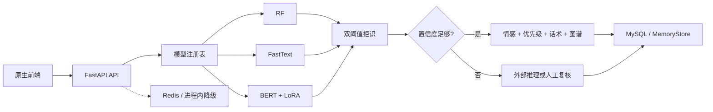

# ShopCare 当前设计文档

## 1. 定位

ShopCare 是一个将中文电商客服反馈转化为结构化处理决策的平台。核心差异是：它不止返回一个分类，而是返回可直接用于派单和复核的完整结果。

## 2. 系统架构

实际入口是 `backend/main.py`，前端由 `frontend/web` 静态托管。项目不依赖构建工具和 Chart.js，前端图表使用原生 Canvas 绘制。

## 3. 模块职责

| 模块 | 职责 |
|---|---|
| `01-data` | 数据、标签、停用词和 EDA |
| `02-rf` | TF-IDF + OneVsRest 随机森林 |
| `03-fasttext` | 多标签 FastText |
| `04-bert` | BERT、LoRA、难例采样、拒识和外部推理适配 |
| `08-sentiment` | 情感词典和规则 |
| `09-priority` | 优先级、SLA 和复核判断 |
| `10-reply-recommend` | 回复模板和审批闸门 |
| `11-ticket-kg` | 标签共现和风险组合 |
| `backend/common/pipeline.py` | 编排模型与业务模块 |
| `backend/common/model_registry.py` | 模型懒加载、可用性探测和降级 |
| `backend/common/store.py` | MySQL 与内存存储适配 |
| `backend/middleware/context.py` | 请求上下文、限流和访问日志 |

## 4. 推理契约

`POST /api/v1/classify` 接收文本、模型选择、是否启用外部推理和 `top_k`，返回：

- 模型名称、标签及每个标签的置信度；
- `rejected`、拒识原因、`resolved_by` 和降级来源；
- 情感、优先级、SLA、责任部门和建议回复；
- 工单 ID、耗时、缓存和审计相关信息。

该统一契约使 RF、FastText 和 BERT 可以在同一工作台中横向对比，也让前端不需要理解各模型的内部输出格式。

## 5. 存储与可靠性

MySQL 保存用户、工单、复核记录和审计日志；Redis 保存分类缓存、固定窗口限流计数和令牌撤销记录。两个组件不可用时服务均可降级运行，但 `/health` 会公开 `degraded` 状态，避免把降级状态误认为正常运行。

模型使用懒加载和进程内缓存，缺失模型不会导致整个服务启动失败。请求不可用模型时会返回明确的降级来源或业务错误。

## 6. 当前状态

已实现：三套分类模型、统一评估与推理、概率校准、双阈值拒识、情感、优先级、话术、共现分析、JWT、限流、缓存、降级、工单 CRUD、复核队列、看板和前端工作台。

未实现：模型量化、蒸馏、剪枝、正式单元测试与 CI、前端权限分级和生产级多实例治理。设计中的规划内容不会作为当前项目成果对外宣称。
